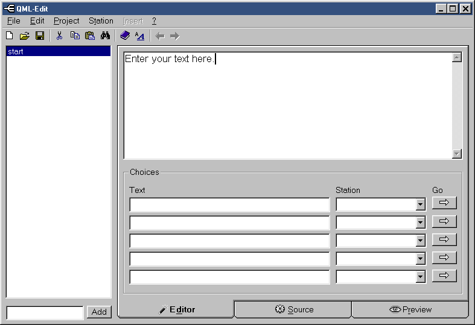
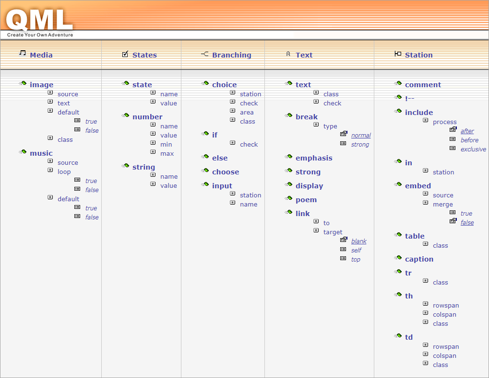

# QuestML

**QML, the Quest Markup Language, is a framework to create Choose Your Own Adventure (CYOA) story games.** This is a **vintage release** from many years ago, coming in the classic flavors of Server-Side Python, PHP, and ASP, Browser-Side VBS, and Windows VB.

➜ <a href="https://www.gamesforthebrain.com/game/googleadventure/">Here's a sample adventure</a> you can play rightaway.



&nbsp;



&nbsp;

In QML, you can create quests using either the editor pictured above, or by manually writing in the QL, or the XML formats. Adventures can have text, images, variables functionality like randomization, and much more. Here's a QL example adventure:

```
"Simple sample", Philipp Lenssen

start
    ---
        There's a treasure chest here, and
        a door leads to the north.

    --> open chest ? ![chest open]
        Open the treasure chest

    --> northern room
        Leave the room

open chest
    ---
        You open the chest and take two
        silver coins.

    _ chest open
    % silver = [silver] + 2
    $ test = hello world

    <--
        Continue

northern room
    ---
        The path leads north.
        You walk a bit, get tired, go to
        sleep & dream about your [silver] silver coins.
        *The End*
```

Here is another sample in XML:

```
<station id="armwrestle try champ">
    <comment>
        Choices are randomized so the peanuts solution won't stick
        out on a second wrestling if the player collected them by
        then.
    </comment>

    <if check="{random 0, 100} greater 50">
        <text>
            You chose one strong monkey to quarrel.
            Your swollen red arm is uncomfortably close to the table by now
        </text>
        <choice station="armwrestle kick chimp">Kick the chimps foot under the table</choice>
        <choice station="armwrestle blow air">Blow some air in his face</choice>
        <choice station="armwrestle throw peanuts" check="[has peanuts]">Throw a peanut with your left hand</choice>
    </if>
    <else>
        <text>
            You chose one strong monkey to quarrel.
            Your swollen red arm is uncomfortably close to the table by now
        </text>
        <choice station="armwrestle tell joke">Tell a joke</choice>
        <choice station="armwrestle throw peanuts" check="[has peanuts]">Throw a peanut with your left hand</choice>
        <choice station="armwrestle concentrate">Concentrate and try harder</choice>
    </else>
</station>
```

Hope you enjoy! More at <a href="http://www.questml.com/">QuestML.com</a>